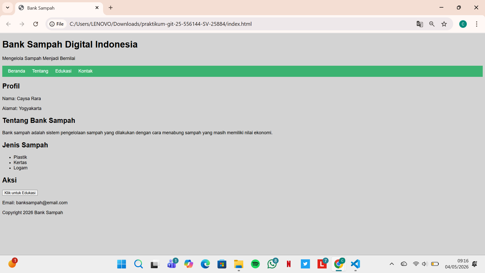
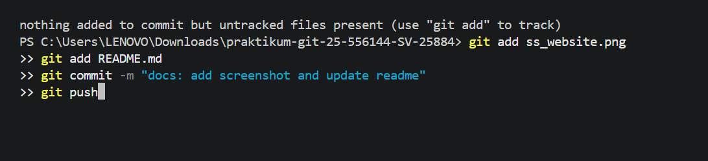
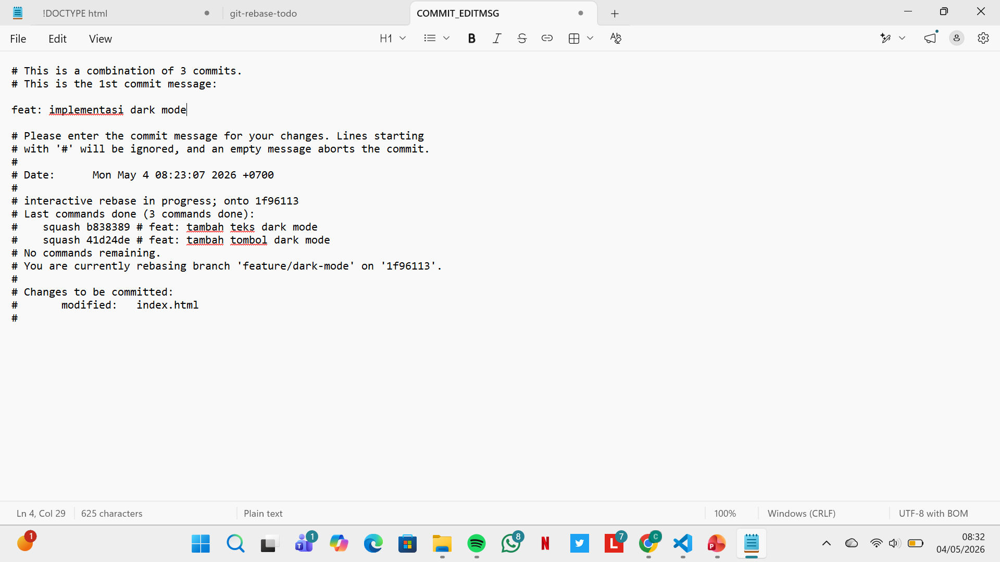
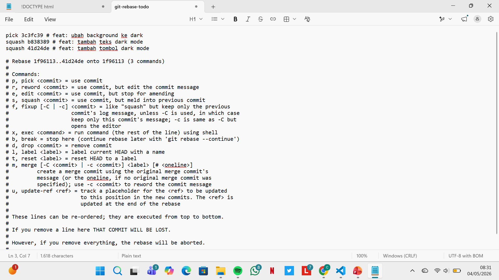
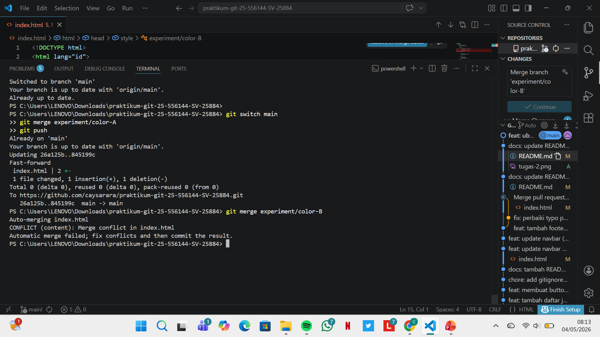
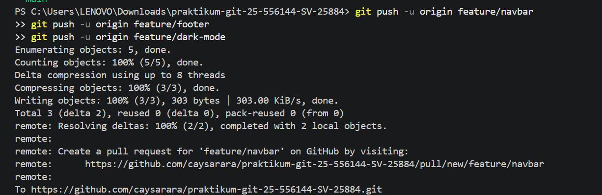
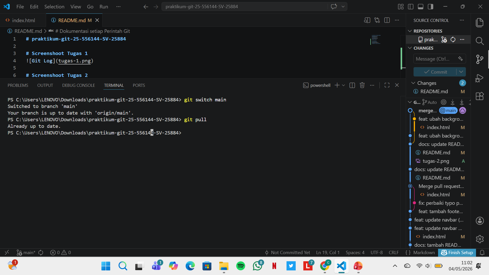
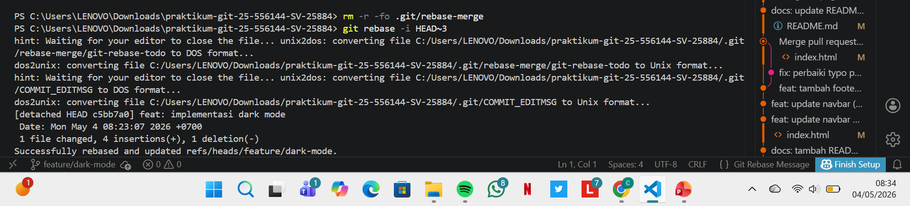

# praktikum-git-25-556144-SV-25884

## Screenshoot Tugas 1

## Screenshoot Tugas 2

## Deskripsi Project
Project ini merupakan website sederhana bertema Bank Sampah Digital yang dibuat untuk menerapkan konsep dasar Git dan GitHub dalam pengelolaan version control. Website ini menampilkan informasi mengenai profil pengguna, penjelasan tentang bank sampah, jenis-jenis sampah yang dikelola, serta fitur edukasi sederhana.

## Cara Menjalankan
1. Clone repository 
    Kode yang digunakan yaitu https://github.com/caysarara/praktikum-git-25-556144-SV-25884.git
2. Buka folder di VS Code
3. Jalankan index.html di browser

## Screenshoot Website

## Dokumentasi setiap Perintah Git

Git mendeteksi ada file baru yang belum disimpan. Perintah git add digunakan untuk memasukkan file ke dalam proses commit. Kemudian git commit untuk menyimpan perubahan, dan git push untuk mengirim ke GitHub.

Perintah ini digunakan untuk menggabungkan beberapa commit terakhir menjadi satu, supaya riwayat commit lebih rapi.

Commit pertama dipakai sebagai utama (pick), lalu commit lainnya digabung (squash) ke dalam commit pertama.

Menampilkan daftar commit secara singkat dan berurutan, sehingga mudah melihat perubahan yang sudah dilakukan.

Branch color-A berhasil digabung ke main. Saat menggabungkan color-B, terjadi konflik karena ada perubahan di bagian yang sama, sehingga harus diperbaiki secara manual.

Mengirim branch ke GitHub agar bisa dibuat Pull Request.

Berpindah ke branch main lalu mengambil update terbaru dari GitHub agar data tetap sama.

Menghapus sisa proses rebase yang gagal, lalu menjalankan kembali rebase sampai berhasil
